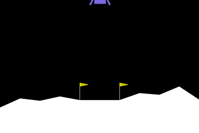

# shinsa-evolve

Can you trust the scores an LLM-driven program-evolution loop reports about its own
candidates? This repository studies that question for *training recipes*: small Python
modules, written by an LLM mutation operator, that control reward shaping, evaluation
schedule, and optimizer settings for a fixed inner training loop (small MLP + separable
CMA-ES).

**Status:** public research artifact and technical report; not peer reviewed. The replicated
evidence is a LunarLander mechanism-and-ablation case study, not a claim of a general law across
models or environments. Read the [technical report](paper/main.pdf).

## Main result

Across a $2\times2$ design with 12 independent outer-loop runs and 180 candidates, selection on
candidate-reported training scores was compared with selection on a fresh-seed raw-reward audit.
With candidate-shaped rewards, reported scores saturated at the contract ceiling and
claimed-selection regret averaged 710.4 raw-reward points. Forcing raw reward during training
removed saturation and reduced mean regret to 110.7, but all three claimed-selection runs still
misranked the best-audited policy in their own archive. Candidate-defined reward scale is therefore
a major amplifier in these runs, not the only source of training-to-audit misranking.

Every candidate gets two scores:

- **claimed** — the best training fitness under the recipe's own measurement (its shaped
  reward, its episode counts, a fixed training seed pool);
- **audited** — an independent re-evaluation of the trained policy on freshly drawn OS-entropy
  seeds, scored by raw environment reward only, with no execution path for recipe code.

The difference is the **honesty gap**. The primary protocol-v3 experiment changes which score
drives selection (`--mode audited` vs `--mode claimed`); audits always run for recording. A
protocol-v4 ablation repeats both modes while forcing raw environment reward during training, so
candidate reward shaping is never called. Environments: MinAtar Breakout (gymnax, jit batch
rollouts) and LunarLander-v3 (gymnasium, spawn process pool). LunarLander is the replicated
evidence; Breakout is retained as a historical single-run pilot and backend check.

### LunarLander environment preview



This is one replay of the audited-selection run with outer seed 101, candidate 9, audit episode
seed 995252232 (raw return 190.06). It illustrates the environment, not an independent run or
the candidate's 32-episode mean. Recreate the animation and paper still from the archived policy:
`python scripts/render_lunar_demo.py`. Rendering makes no training, model, or network calls.

This is a clean-room, from-scratch implementation; it contains no code, prompts, data, or
text from any prior private implementation.

## Install

```bash
python3.11 -m venv .venv && source .venv/bin/activate
pip install -e ".[dev]"
pip install swig && pip install "gymnasium[box2d]"   # box2d needs swig at build time
```

The recovered macOS/Python 3.11 environment is recorded in
`requirements-lock-py311-macos.txt`. To reproduce that exact version set:

```bash
pip install -r requirements-lock-py311-macos.txt
pip install -e . --no-deps --no-build-isolation
```

## Smoke test (no LLM calls)

```bash
bash scripts/smoke.sh
```

The smoke script creates a fresh temporary run directory every time and prints its path. Set
`SHINSA_SMOKE_ROOT` only when you intentionally want a persistent location.

One-mutation LLM smoke (uses the `codex` CLI once through the locally logged-in ChatGPT
account and therefore requires an explicit model):

```bash
export SHINSA_MUTATE_PROVIDER=codex
export SHINSA_MUTATE_MODEL=gpt-5.6-sol
export SHINSA_MUTATE_REASONING=low
.venv/bin/python -m shinsa_evolve.core.orchestrate --env breakout --mode audited \
    --run-dir runs/protocol_v3_codex/smoke --smoke-llm
```

## Full matrix

```bash
bash scripts/run_matrix.sh
```

New runs store an immutable configuration, exact runtime package versions, mutation CLI/model
identity, an outer-loop RNG checkpoint, audit seeds and per-episode returns, and full training
history. Rerunning the same command resumes from `archive.jsonl`; changed configuration or a
missing RNG checkpoint is rejected rather than silently producing a mixed run. The matrix writes
to `runs/protocol_v3_codex/` by default so it cannot modify the recovered historical archives.

The primary experiment is three LunarLander outer loops per mode at a matched 15-candidate
budget. Its launcher fixes the model and RNG seeds but is intentionally not invoked by tests
because it makes external model calls:

```bash
.venv/bin/python scripts/estimate_replication_cost.py
bash scripts/run_lunar_replications.sh
```

The launchers use non-interactive `codex exec` with an ephemeral session, ignored user
configuration/rules, an empty read-only working directory, and `SHINSA_MUTATE_REASONING=low`.
Authenticate first with `codex login` using ChatGPT; this path consumes Codex subscription
allowance rather than API credits. Override the binary with `SHINSA_CODEX_BIN`.
`SHINSA_MUTATE_MODEL` is mandatory for any run that mutates candidates. The implementation
also retains the legacy `claude` provider, selected with `SHINSA_MUTATE_PROVIDER=claude` and
overridden with `SHINSA_CLAUDE_BIN`.

Mutation protocol v3 records a hash of the full static prompt in `run_config.json`, states the
validator's shaped-reward magnitude bound in the contract, feeds rejection reasons into retry
prompts, and preserves every failed attempt as structured archive data. Protocol-v2 Codex runs
are pilots and must not be pooled with protocol-v3 results.

Protocol v4 adds `--training-reward fixed_raw`. In that mode the trainer substitutes raw
environment reward and never calls a candidate's shaping function, while candidates still choose
optimizer and evaluation schedules. This is a joint reward-content-and-scale ablation, not a
pure normalization experiment.

Note: recipe code is LLM-generated Python executed in-process. Static checks reject forbidden
imports and several common direct IO/reflection calls as hygiene, but cannot exclude every IO or
side-effect path. This is not a security sandbox — run on infrastructure you trust with nothing
sensitive in the environment.

## Protocol-v3 primary evidence

Recompute the six-run LunarLander summary without importing or executing generated recipes:

```bash
PYTHONDONTWRITEBYTECODE=1 .venv/bin/python scripts/analyze_replications.py \
  --runs-root runs/protocol_v3_codex/lunar_replications \
  --output evidence/protocol_v3_lunar_summary.json
```

The machine-readable result records three independent outer runs per mode, the actual selected
policy, the best audited policy available in each archive, actual and tie-robust selection regret,
prompt/model provenance, and model usage. See `evidence/PROTOCOL_V3_CLAIM_AUDIT.md` for the exact
claim boundary.

Build the sanitized public data asset locally:

```bash
.venv/bin/python scripts/build_replication_bundle.py \
  --runs-root runs/protocol_v3_codex/lunar_replications \
  --summary evidence/protocol_v3_lunar_summary.json \
  --output dist/shinsa-evolve-protocol-v3-lunar-v1 \
  --archive dist/shinsa-evolve-protocol-v3-lunar-v1.tar.gz
```

## Protocol-v4 fixed-raw ablation

Recompute the six-run fixed-raw summary without importing or executing generated recipes:

```bash
PYTHONDONTWRITEBYTECODE=1 .venv/bin/python scripts/analyze_fixed_raw_replications.py \
  --runs-root runs/protocol_v4_fixed_raw \
  --output evidence/protocol_v4_fixed_raw_summary.json
```

Build its separate sanitized public asset. The builder includes only the six successful runs and
excludes the failed first seed-101 attempt:

```bash
.venv/bin/python scripts/build_fixed_raw_bundle.py \
  --runs-root runs/protocol_v4_fixed_raw \
  --summary evidence/protocol_v4_fixed_raw_summary.json \
  --output dist/shinsa-evolve-protocol-v4-fixed-raw-v1 \
  --archive dist/shinsa-evolve-protocol-v4-fixed-raw-v1.tar.gz
```

Generate the combined paper figures and compile the manuscript:

```bash
MPLCONFIGDIR=/tmp/shinsa-mpl .venv/bin/python \
  -m shinsa_evolve.analyze.replication_figures \
  --summary evidence/protocol_v3_lunar_summary.json \
  --runs-root runs/protocol_v3_codex/lunar_replications \
  --fixed-raw-summary evidence/protocol_v4_fixed_raw_summary.json \
  --out paper/figs
(cd paper && tectonic -X compile main.tex)
```

## Historical pilot evidence

The historical paper numbers can be checked without executing generated recipes:

```bash
PYTHONDONTWRITEBYTECODE=1 .venv/bin/python scripts/verify_evidence.py
```

The frozen machine-readable snapshot and claim boundaries are under `evidence/`. The historical
run directories remain local and ignored. The approved public form is a sanitized, checksummed
GitHub Release asset built locally with:

```bash
.venv/bin/python scripts/build_release_bundle.py \
  --output dist/shinsa-evolve-historical-runs-v1 \
  --archive dist/shinsa-evolve-historical-runs-v1.tar.gz
```

## Authorship and AI assistance

This is an independent research project by Qindong Gan. LLM coding assistants were used during
implementation, debugging, analysis, and manuscript editing. Research scope, experiment approval,
evidence checks, claim boundaries, and public-release decisions remained under the author's
oversight. Exact mutation-model provenance for the experiments is recorded in each run archive.

License: Apache-2.0. See `LICENSE`.
