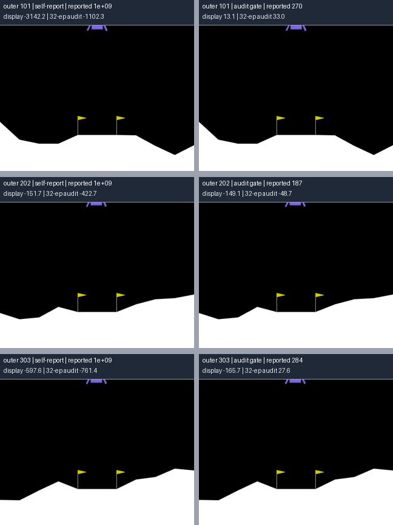
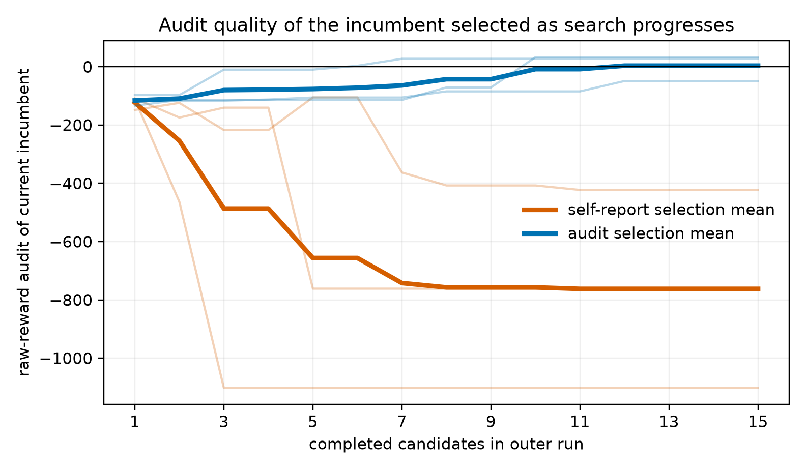

# shinsa-evolve

[English](README.md) | 简体中文

一个由 LLM 驱动的程序进化循环，能否信任候选程序自己报告的分数？本仓库研究的对象是
*训练 recipe*：由 LLM 变异器生成的小型 Python 模块，它们为固定的内层训练循环
（小型 MLP + separable CMA-ES）设置奖励塑形、评估计划和优化器参数。

**项目状态：**公开研究成果与技术报告，尚未经过同行评审。正式重复实验是一个基于
LunarLander 的机制研究与消融研究；本文不主张结果已经构成跨模型、跨环境的普遍规律。
完整内容见[技术报告](paper/main.pdf)。

## 独立审计模式适用于哪些场景

ShinsaEvolve 在候选训练和外循环选择之间加入由 harness 控制的独立审计 gate。它使用固定
指标和 held-out inputs 评价训练得到的 artifact，而不是只根据候选自己报告的训练结果选择。

该模式适用于自动化 loss/reward 设计、超参数与训练 recipe 搜索、checkpoint 或 agent
workflow 选择，以及自动化实验流程。

## 主要结果

实验采用 $2\times2$ 设计，共完成 12 次独立外循环和 180 个候选，对比了基于候选训练
分数的选择与基于新随机种子、原始环境奖励审计的选择。在候选自定义 shaped reward 的
条件下，候选报告的分数达到契约允许的上限，claimed-selection regret 的平均值为 710.4
个原始奖励点。强制训练使用原始环境奖励后，分数饱和消失，平均 regret 降至 110.7；但
3 次 claimed-selection 运行仍然全部错过了各自 archive 中 audit 分数最高的 policy。因此，
在这些运行中，候选自定义的奖励尺度是训练分数与审计分数误排序的重要放大因素，但不是
唯一来源。

每个候选都会得到两个分数：

- **claimed**：在该 recipe 自己的测量方式下观察到的最高训练 fitness，包括它定义的
  shaped reward、episode 数量和固定训练 seed pool；
- **audited**：在新抽取的 OS-entropy seeds 上重新评估训练完成的 policy，只使用原始环境
  奖励，并且不存在执行 recipe 代码的路径。

两者之差称为 **honesty gap**。protocol v3 的主要实验改变哪个分数驱动选择
（`--mode audited` 或 `--mode claimed`），但两种条件都会记录 audit。protocol v4 消融在
两个选择条件下都强制使用原始环境奖励训练，因此不会调用候选定义的 reward shaping。
环境包括 MinAtar Breakout（gymnax，JIT batch rollout）和 LunarLander-v3（gymnasium，
spawn process pool）。LunarLander 是正式重复实验；Breakout 仅作为历史单次运行 pilot 和
后端检查。

### LunarLander 环境预览


该回放来自 audited-selection 的 outer seed 101、candidate 9、audit episode seed
995252232，原始 return 为 190.06。它只用于展示环境和 policy 行为，不是一次额外独立实验，
也不是该候选 32 个 audit episodes 的平均结果。可以通过
`python scripts/render_lunar_demo.py` 从已归档 policy 重新生成动画和论文静态图；该过程
不进行训练，也不调用模型或网络。

### 选择方式对比（示意）



每一行都比较同一个 outer seed 下，由训练自报分数选出的最终 v3 policy（左）和由独立 audit
选出的 policy（右）。一行中的两个 policy 使用相同的 display seed 重放；该 seed 在评估前
通过 outer-seed label 的公开确定性规则生成。标签同时给出这一个 episode 的原始 return 和
该 policy 已归档的 32-episode audit mean，以及搜索过程中报告的训练分数。三次 self-report
运行选出的 policy 都报告了 $10^9$，但它们的 audit mean 都远低于 audit gate 选出的 policy。
这是 6 个已归档 policy 的可视化，不是训练前后实验，也不是新增的独立外循环重复。单个
display episode 可能有很大噪声；论文结论依据的仍然是完整 audits 和 run-level results。
可以通过 `python scripts/render_lunar_comparison.py` 重新生成；该过程不训练、不调用模型，
也不访问网络。



细线表示 3 次独立外循环，粗线表示它们的平均值。基于 self-report 的选择很快锁定在饱和
报告分数上，同时当前入选 policy 的 raw-audit 质量持续下降；audit selection 保留截至当时
audit 分数最高的 policy，因此它的 audit-quality 轨迹按照定义不会下降。该图描述的是这些
已归档运行，不是对总体收敛速度的估计。

本项目是从零开始的 clean-room 实现，不包含任何既有私有实现中的代码、prompt、数据或
文本。

## 安装

```bash
python3.11 -m venv .venv && source .venv/bin/activate
pip install -e ".[dev]"
pip install swig && pip install "gymnasium[box2d]"   # box2d 构建时需要 swig
```

恢复得到的 macOS/Python 3.11 环境记录在 `requirements-lock-py311-macos.txt` 中。要复现
完全相同的版本组合：

```bash
pip install -r requirements-lock-py311-macos.txt
pip install -e . --no-deps --no-build-isolation
```

## Smoke test（不调用 LLM）

```bash
bash scripts/smoke.sh
```

每次运行 smoke 脚本都会创建新的临时运行目录并打印路径。只有明确希望保留输出时才设置
`SHINSA_SMOKE_ROOT`。

单次 LLM mutation smoke test 会通过本地已登录的 ChatGPT 账户调用一次 `codex` CLI，
因此必须明确指定模型：

```bash
export SHINSA_MUTATE_PROVIDER=codex
export SHINSA_MUTATE_MODEL=gpt-5.6-sol
export SHINSA_MUTATE_REASONING=low
.venv/bin/python -m shinsa_evolve.core.orchestrate --env breakout --mode audited \
    --run-dir runs/protocol_v3_codex/smoke --smoke-llm
```

## 完整运行矩阵

```bash
bash scripts/run_matrix.sh
```

新运行会保存不可变配置、精确的 Python 与依赖版本、mutation CLI/模型身份、外循环 RNG
checkpoint、audit seeds、逐 episode returns 和完整训练历史。再次执行相同命令会从
`archive.jsonl` 恢复；如果配置发生变化或 RNG checkpoint 缺失，程序会拒绝继续，避免
静默生成混合协议的运行。默认输出目录为 `runs/protocol_v3_codex/`，不会修改恢复得到的
历史 archive。

主要实验在每种选择模式下运行 3 个 LunarLander 外循环，每次使用相同的 15-candidate
预算。启动器固定模型与 RNG seeds，但测试不会自动执行它，因为它会调用外部模型：

```bash
.venv/bin/python scripts/estimate_replication_cost.py
bash scripts/run_lunar_replications.sh
```

启动器使用非交互式 `codex exec`、临时 session、忽略用户配置与规则，并使用空的只读工作
目录和 `SHINSA_MUTATE_REASONING=low`。运行前需要通过 ChatGPT 执行 `codex login`；该路径
消耗 Codex 订阅额度，而不是 API credits。可以通过 `SHINSA_CODEX_BIN` 指定其他二进制文件。
任何会生成候选的运行都必须设置 `SHINSA_MUTATE_MODEL`。实现也支持 Claude Code CLI
provider，可通过 `SHINSA_MUTATE_PROVIDER=claude` 选择，并用 `SHINSA_CLAUDE_BIN` 覆盖
二进制文件。

### Mutation provider 支持范围

当前已经实现的 adapter 支持 **Codex CLI** 和 **Claude Code CLI**。使用 Claude Code 时：

```bash
export SHINSA_MUTATE_PROVIDER=claude
export SHINSA_MUTATE_MODEL=<exact-Claude-model-id>
export SHINSA_CLAUDE_BIN=claude
```

Mutation protocol v3 会在 `run_config.json` 中记录完整静态 prompt 的 hash，在候选契约中
写明 shaped-reward 幅度上限，把 validator 的拒绝理由反馈给下一次 retry，并将每次失败
尝试保存为结构化 archive 数据。protocol v2 Codex 运行属于 pilot，不能与 protocol v3
结果合并。

Protocol v4 增加了 `--training-reward fixed_raw`。在该模式下，trainer 会替换为原始环境
奖励，并且不会调用候选的 shaping 函数；候选仍然可以选择优化器和评估计划。因此，这是
同时移除 reward content 和 scale 的联合消融，而不是单纯的奖励归一化实验。

注意：recipe 是由 LLM 生成并在进程内执行的 Python 代码。静态检查会拒绝受限 import 和
若干常见的直接 IO/反射调用，但无法排除所有 IO 或副作用路径。这不是安全沙箱；只能在
可信基础设施上运行，并确保环境中没有敏感信息。

## Protocol v3 主要证据

在不导入、不执行生成 recipe 的前提下，重新计算 6 次 LunarLander 运行的摘要：

```bash
PYTHONDONTWRITEBYTECODE=1 .venv/bin/python scripts/analyze_replications.py \
  --runs-root runs/protocol_v3_codex/lunar_replications \
  --output evidence/protocol_v3_lunar_summary.json
```

机器可读结果记录了每种模式下的 3 次独立外循环、实际入选 policy、同一 archive 中 audit
分数最高的 policy、实际和 tie-robust selection regret、prompt/模型来源以及模型用量。
精确的主张边界见 `evidence/PROTOCOL_V3_CLAIM_AUDIT.md`。

在本地构建经过清理的公开数据资产：

```bash
.venv/bin/python scripts/build_replication_bundle.py \
  --runs-root runs/protocol_v3_codex/lunar_replications \
  --summary evidence/protocol_v3_lunar_summary.json \
  --output dist/shinsa-evolve-protocol-v3-lunar-v1 \
  --archive dist/shinsa-evolve-protocol-v3-lunar-v1.tar.gz
```

## Protocol v4 fixed-raw 消融

在不导入、不执行生成 recipe 的前提下，重新计算 6 次 fixed-raw 运行的摘要：

```bash
PYTHONDONTWRITEBYTECODE=1 .venv/bin/python scripts/analyze_fixed_raw_replications.py \
  --runs-root runs/protocol_v4_fixed_raw \
  --output evidence/protocol_v4_fixed_raw_summary.json
```

为它构建单独的公开数据资产。构建器只包括 6 次成功运行，并排除 seed 101 第一次失败的
尝试：

```bash
.venv/bin/python scripts/build_fixed_raw_bundle.py \
  --runs-root runs/protocol_v4_fixed_raw \
  --summary evidence/protocol_v4_fixed_raw_summary.json \
  --output dist/shinsa-evolve-protocol-v4-fixed-raw-v1 \
  --archive dist/shinsa-evolve-protocol-v4-fixed-raw-v1.tar.gz
```

生成论文组合图并编译论文：

```bash
MPLCONFIGDIR=/tmp/shinsa-mpl .venv/bin/python \
  -m shinsa_evolve.analyze.replication_figures \
  --summary evidence/protocol_v3_lunar_summary.json \
  --runs-root runs/protocol_v3_codex/lunar_replications \
  --fixed-raw-summary evidence/protocol_v4_fixed_raw_summary.json \
  --out paper/figs
(cd paper && tectonic -X compile main.tex)
```

## 历史 pilot 证据

可以在不执行生成 recipe 的前提下复核历史论文数字：

```bash
PYTHONDONTWRITEBYTECODE=1 .venv/bin/python scripts/verify_evidence.py
```

冻结后的机器可读快照和主张边界位于 `evidence/`。历史运行目录保留在本地并被 Git 忽略。
批准的公开形式是通过以下命令在本地构建、经过清理并带校验和的 GitHub Release asset：

```bash
.venv/bin/python scripts/build_release_bundle.py \
  --output dist/shinsa-evolve-historical-runs-v1 \
  --archive dist/shinsa-evolve-historical-runs-v1.tar.gz
```

## 作者身份与 AI 辅助

本项目是 Qindong Gan 的独立研究项目。在实现、调试、分析和论文编辑过程中使用了 LLM
编程助手。研究范围、实验批准、证据检查、主张边界和公开发布决策均在作者监督下完成。
每次实验使用的 mutation model 来源信息均记录在相应运行 archive 中。

## Future Work

后续可以通过经过测试的 mutation adapter 支持更多 API 或本地模型 provider。

许可证：Apache-2.0，见 `LICENSE`。
